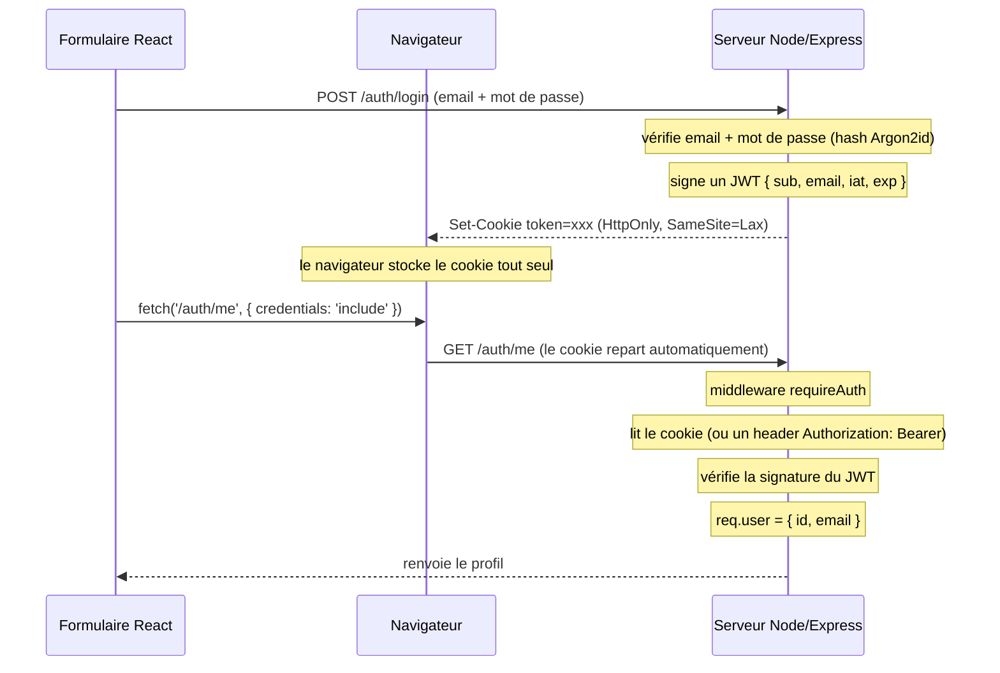

# 🔐 TP - Authentification (React + Node/TypeScript)

Ce dépôt contient **le code** du TP : un mini système d'authentification complet
(React + API Node), avec un `starter/` à compléter. Le corrigé est fourni **chiffré**
(`corrige.7z`) ; la passphrase est communiquée **après la remise**.

> 📘 **L'énoncé du TP** - la théorie, le fonctionnement du backend fourni, les 3 points à
> coder côté React, les indices et le barème - est sur le **workshop guidé** :
> <https://antho-instructor.github.io/workshop-auth/>

Le trajet complet d'une authentification, du formulaire React jusqu'à la route d'API protégée :



À la fin, tu sais répondre à : **« quand je suis connecté, qu'est-ce qui prouve au serveur que c'est bien moi, à chaque requête ? »**

---

## Stack

|          | Techno                                                                                               |
| -------- | ---------------------------------------------------------------------------------------------------- |
| Frontend | React 19 + TypeScript + Vite 7 + Tailwind v4 + React Router v7 (_data mode_ : `createBrowserRouter`) |
| Backend  | Node 22 + TypeScript + Express 5                                                                     |
| Auth     | `jsonwebtoken` (JWT), `@node-rs/argon2` (hash Argon2id), `cookie-parser`, `cors`                     |
| « BDD »  | `lowdb` - un simple fichier `db.json`                                                                |
| Monorepo | npm **workspaces** (`client` + `server`), lancés ensemble avec `concurrently`                        |

---

## Contenu du dépôt

```
auth/
├── README.md        ← vous êtes ici : présentation + comment lancer / tester
├── starter/         ← le TP : backend FOURNI complet ; 3 TODO à faire côté React
└── corrige.7z       ← le projet complet et 100 % commenté, CHIFFRÉ (passphrase après la remise)
```

> **Le backend est écrit et fonctionnel.** Le travail du TP est **côté React** : dans
> `starter/`, 3 points à compléter (`credentials: 'include'`, la garde de route, le
> `handleSubmit` du login). Énoncé détaillé, indices et barème dans le
> [workshop](https://antho-instructor.github.io/workshop-auth/).

---

## Corrigé (`corrige.7z`)

Le corrigé complet est dans `corrige.7z`, chiffré en AES-256. **La passphrase est donnée
après la remise**, pour que tu compares ton travail avec la solution de référence.

| OS          | Comment ouvrir                                                                         |
| ----------- | ------------------------------------------------------------------------------------- |
| **Windows** | [7-Zip](https://www.7-zip.org/) → clic droit sur `corrige.7z` → 7-Zip → « Extraire ici » → saisir la passphrase |
| **macOS**   | `brew install sevenzip` puis `7zz x corrige.7z` — ou l'app [Keka](https://www.keka.io/) (double-clic + passphrase) |
| **Linux**   | `sudo apt install p7zip-full` puis `7z x corrige.7z`                                  |

Puis : `cd solution && npm install && npm run dev`.

---

## Démarrer

```bash
# Le TP à faire :
cd starter && npm install && npm run dev
```

- API : http://localhost:3001
- Front : http://localhost:5173
- Comptes de test : `alice@ynov.com` / `password123` - `bob@ynov.com` / `password123`

---

## Tester l'API à la main

Pour appeler l'API directement (sans passer par le front), il te faut un **client HTTP**.

- **`curl`** est déjà installé partout - rien à installer.
- Pour quelque chose de plus confortable (historique des requêtes, onglet _Cookies_, header
  `Authorization` en un clic), installe une **app dédiée** :
    - [Bruno](https://www.usebruno.com/) - léger, open source, les requêtes se stockent dans des fichiers
    - [Postman](https://www.postman.com/downloads/) - le plus répandu
    - [Hoppscotch](https://hoppscotch.io/) (web), l'extension _REST Client_ de VS Code, Insomnia… au choix

```bash
# login : -c enregistre le cookie reçu dans cookies.txt
curl -i -c cookies.txt -H 'Content-Type: application/json' \
  -d '{"email":"alice@ynov.com","password":"password123"}' \
  http://localhost:3001/auth/login          # → 200 + en-tête Set-Cookie

# me AVEC le cookie : -b renvoie cookies.txt
curl -i -b cookies.txt http://localhost:3001/auth/me   # → 200 + { user }

# me SANS rien
curl -i http://localhost:3001/auth/me                  # → 401

# mauvais mot de passe
curl -i -H 'Content-Type: application/json' \
  -d '{"email":"alice@ynov.com","password":"nope"}' \
  http://localhost:3001/auth/login                     # → 401 "Identifiants invalides"
```

C'est ce qui permet, au moment de la validation, de rejouer `GET /auth/me` avec un header
`Authorization: Bearer <token>` au lieu du cookie.
